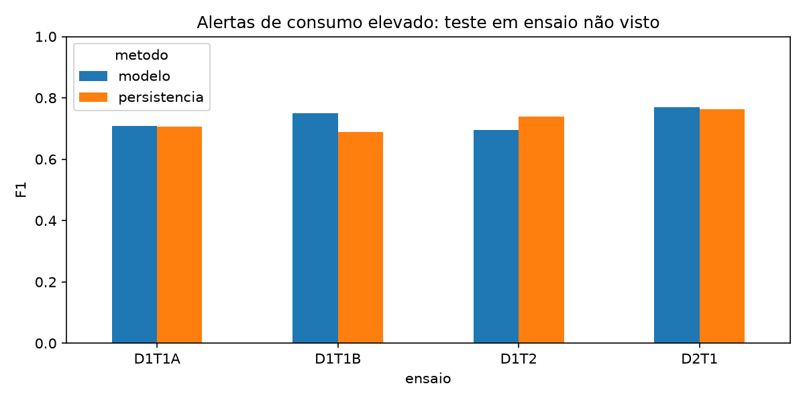
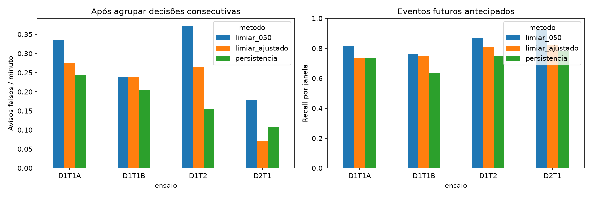
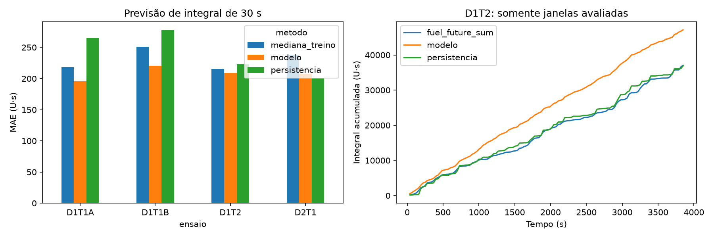
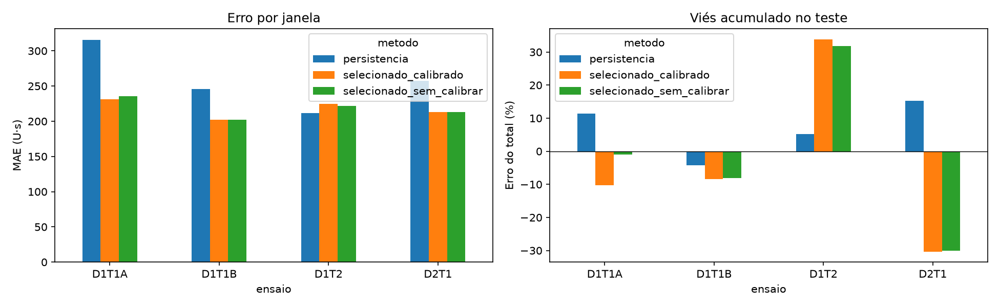
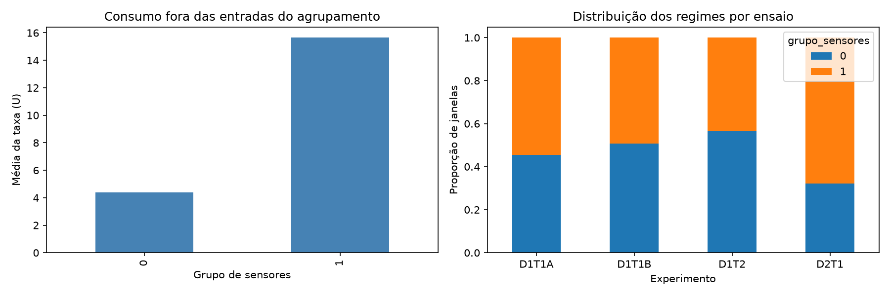
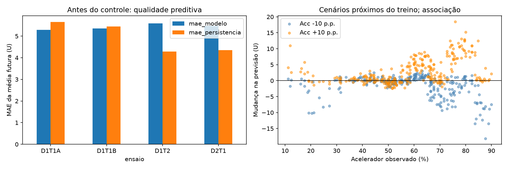
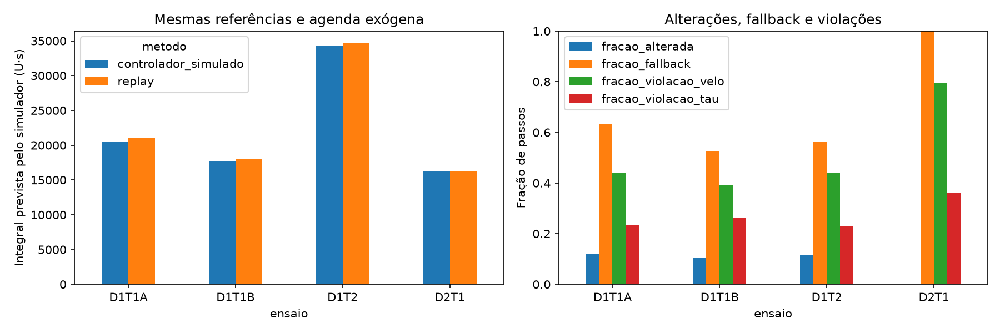

# Aplicações da previsão de consumo de combustível

Complemento de [Sugestões de machine learning](SUGESTOES_MACHINE_LEARNING.md).
Os quatro notebooks foram executados com os dados reais de `Motor/Dados/`; as tabelas abaixo foram extraídas de seus CSVs de resultados. O objetivo é testar utilidade e limites de cada aplicação, incluindo resultados desfavoráveis.

As seções 1, 2 e 4 incluem uma extensão executada com seleção interna de limiar, calibração testada e simulação dinâmica. Os resultados iniciais foram preservados para comparação; os novos CSVs ficam nas subpastas `melhorias/`.

## Mapa das aplicações

| Aplicação | Aprendizado | Notebook executado |
| --- | --- | --- |
| [Orientação ao motorista](#orientacao-motorista) | Supervisionado: classificação | [01 — alertas](notebooks/01_orientacao_motorista.ipynb) |
| [Planejamento energético](#planejamento-energetico) | Supervisionado: regressão | [02 — consumo acumulado](notebooks/02_planejamento_energetico.ipynb) |
| [Análise da operação](#analise-operacao) | Não supervisionado: agrupamento | [03 — regimes](notebooks/03_analise_operacao.ipynb) |
| [Controle automático](#controle-automatico) | Regressão e cenários observacionais | [04 — sensibilidade](notebooks/04_controle_automatico.ipynb) |

## Resumo para revisão: o que buscamos e o que encontramos

O objetivo é descobrir padrões de operação e avaliar se os sensores permitem antecipar consumo. A ideia inicial de medir **severidade** ainda depende de uma definição validada e de rótulos: não há falhas ou níveis de severidade confirmados na base.

| Frente | O que queríamos verificar | Resultado observado | Conclusão |
| --- | --- | --- | --- |
| Alertas — supervisionado | Antecipar consumo elevado nos próximos 10 s, reduzindo avisos falsos. | Falsos positivos por janela caíram de 113 para 79; falsos negativos subiram de 35 para 50. Avisos falsos agrupados caíram de 47 para 35. | Reduzir alertas teve custo de detecção; a utilidade depende do custo de cada erro. |
| Planejamento — supervisionado | Prever consumo acumulado em 30 s e reduzir o viés do total. | A calibração com resíduos da validação interna piorou o erro percentual absoluto do total nos quatro ensaios externos. | A correção testada não resolveu o viés entre ensaios; não sustenta orçamento confiável em litros. |
| Regimes — não supervisionado | Encontrar padrões de operação sem rótulos de severidade. | KMeans selecionou dois grupos; silhouette de 0,296 com sensores e 0,283 com Pi. Os grupos de sensores tiveram consumo médio de 4,37 e 15,65 U. | Existem perfis observados diferentes, mas os grupos não comprovam severidade nem desperdício. |
| Controle — regressão e simulação | Comparar ações de acelerador que reduzam consumo previsto mantendo velocidade e torque de referência. | Diferenças internas de consumo entre cerca de −2,74% e 0%, com fallback em 52,71% a 100% dos passos e violações das restrições. | Não foi demonstrada economia real nem controle validado de injeção. |

Os resultados por ensaio, referências de comparação e arquivos de evidência estão nas quatro seções abaixo. **As sugestões envolvendo `Diem` são próximos experimentos, ainda não executados.**

Na revisão, vale conferir a separação temporal e por ensaio; avaliar os custos dos alertas errados; investigar por que a calibração não transferiu entre ensaios; e discutir se os grupos refletem carga/rota ou padrões operacionais de interesse. A definição e a unidade de cada sensor precisam sustentar qualquer interpretação física.

## Dados, unidades e protocolo comum

- São **9.339 amostras**: D1T1A (1.984), D1T1B (1.776), D1T2 (3.876) e D2T1 (1.703). Os contadores avançam de 1 em 1; os notebooks exigem intervalo de 1 segundo, conforme a identificação da coluna `Temp`.
- Usamos os aliases dos sensores e os Pi efetivamente gerados por `Main_Motor.py`. A junção é por `Experimento` e `Temp`, validada como um para um. Os CSVs brutos permanecem inalterados.
- **U = unidade numérica registrada em `Taccm`.** O cabeçalho declara m³/s, mas os valores chegam a 61,9, o que exige confirmação da unidade/calibração. Por isso, taxas são apresentadas em U e integrais em U·s. Não estimamos litros, economia em dinheiro ou autonomia real.
- Na primeira rodada, as entradas supervisionadas foram: sensores atuais `Velo`, `Acc`, `Brake`, `Gear`, `n`, `Tau`, `Taccm`, `TeLam`, `Team`; `Pi_6_log10` e `Pi_8` atuais; média, desvio-padrão e diferença entre início/fim do histórico para velocidade, acelerador, rotação, torque e consumo. São 26 atributos. As extensões usam seleção de histórico/atributos e uma dinâmica de estado atual descritas nas seções correspondentes.
- `Pi_6 = Taccm / (Temp² × Velo³)` pode estar indefinido em paradas; o modelo usa imputação aprendida no treino e indicadores de ausência. **Excluir `Pi_4` não elimina o efeito do tempo: `Pi_6` também contém `Temp`.** Isso pode dificultar generalização; a extensão de planejamento energético abaixo testou a retirada de `Pi_6` com validação interna.
- Estas são as mesmas quatro coletas já exploradas: o ensaio externo fica fora dos ajustes automáticos de cada rodada, mas não constitui uma nova coleta independente. Novos dados serão necessários para confirmar a generalização dos ajustes.
- Nas tarefas supervisionadas, deixamos um ensaio inteiro de fora por vez. A imputação, a classificação de consumo elevado e a padronização do filtro de proximidade são ajustadas apenas no treino. Os parâmetros dos estimadores e as sementes são fixos. Nas extensões, limiar, histórico e presença de Pi_6 são selecionados apenas em validação interna, sem usar o ensaio externo.
- Na primeira rodada, entradas em t usam somente t−9 até t; a extensão de energia também testa 30 s de histórico, e a dinâmica usa o estado atual. As respostas são os valores posteriores, de t+1 até t+h. As janelas-alvo não se sobrepõem dentro de cada experimento avaliado. Ainda existe dependência temporal entre janelas; quatro ensaios não equivalem a centenas de coletas independentes.
- Estes alvos diferem da previsão **pontual** `Taccm(t+10)` do documento original: aqui usamos a **média dos próximos 10 s** ou a **integral dos próximos 30 s**. Não compare diretamente os valores de erro entre tarefas.

### Esclarecimento sobre `Diem` — 27/09/2026

**`Diem` representa tempo de abertura da injeção + pressão de injeção**. O “+” indica a participação das duas grandezas na descrição da injeção; ele não define uma soma numérica entre tempo e pressão, que têm dimensões diferentes.

Nos arquivos disponíveis há uma única coluna `Diem` por ensaio, identificada como m³/s. A planilha também menciona uma grandeza de origem em mm³/ciclo. Não há colunas separadas de duração de abertura e pressão nos cabeçalhos dos dados. Portanto, a definição conceitual está registrada, mas ainda falta confirmar **como duração e pressão foram transformadas no valor escalar de `Diem`**, suas unidades e se o registro é medição, comando ou valor calculado.

- **Previsão supervisionada:** uma próxima comparação pode acrescentar `Diem(t)` e seu histórico para prever consumo futuro, usando somente D1T2 e D2T1, onde a variável existe. Comparar modelos com e sem `Diem` nas mesmas janelas, treinando em um ensaio e testando no outro, sem seleção de parâmetros no teste. Não usar `Diem` futuro nem preencher ensaios inteiros ausentes com zero. Com apenas dois ensaios, a conclusão será exploratória. Essa comparação ainda não foi executada.
- **Análise não supervisionada:** nesses mesmos dois ensaios, explorar agrupamentos de `Diem`, `Tau`, `n` e consumo, com padronização e comparação da composição por ensaio. Os grupos indicariam regimes observados de injeção/operação; não identificariam separadamente o efeito da pressão e da abertura.
- **Controle:** para testar duração de abertura e pressão como duas ações, precisamos das duas séries separadas, unidades, limites, sincronização e identificação de comandos versus medições. Uma única coluna composta não permite recuperar de forma única esses dois valores. A simulação executada continua atuando sobre `Acc`; a definição recebida não permite transformá-la em controle de injeção.
- **`Pi_5`:** a expressão `Diem / (Temp² × Velo³)` só é adimensional sob a dimensão de vazão (L³/T) declarada na tabela atual. A nova descrição conceitual não confirma essa dimensão. Se `Diem` tiver outra dimensão ou for desdobrada em duração e pressão, será necessário corrigir os metadados e recalcular os grupos Pi. Os Pi existentes mantêm a hipótese documental original.

A unidade/calibração de `Taccm` continua pendente. Os resultados já executados não usam `Diem` nem `Pi_5` como entrada e não mudam com esse esclarecimento.

<a id="orientacao-motorista"></a>
## 1. Orientação ao motorista — supervisionado

**Para que serviria:** antecipar um período de consumo elevado para que o motorista ou analista possa avaliar a condução. Um alerta não significa que o consumo é desnecessário: a demanda de torque, o trajeto e o trânsito podem justificá-lo.

**Experimento executado:** o alvo é a média de consumo nos próximos 10 s acima do percentil 75 das médias futuras do treino. Uma Random Forest recebe sensores e histórico. A referência emite alerta quando o consumo atual já supera esse mesmo limite. Limiar de probabilidade do modelo: 0,5.

### Resultados

| Teste | Janelas | Limite (U) | F1 referência | F1 modelo | Precisão modelo | Recall modelo |
| --- | --- | --- | --- | --- | --- | --- |
| D1T1A | 197 | 16,51 | 0,706 | 0,708 | 0,625 | 0,816 |
| D1T1B | 176 | 16,46 | 0,690 | 0,750 | 0,735 | 0,766 |
| D1T2 | 386 | 17,20 | 0,738 | 0,696 | 0,581 | 0,867 |
| D2T1 | 169 | 16,17 | 0,762 | 0,770 | 0,662 | 0,922 |

O modelo teve F1 maior em **3 de 4 ensaios**, com ganho muito pequeno em D1T1A. O recall aumentou nos quatro ensaios, mas a precisão diminuiu: foram antecipados mais eventos à custa de mais falsos alertas. Em D1T2, o F1 piorou. Portanto, ainda não há evidência para afirmar que um sistema desses reduziria consumo no uso real.



**O que o notebook entrega:** probabilidades, alertas, eventos realmente ocorridos e métricas por ensaio. O rótulo é um evento futuro definido por regra estatística; não é severidade validada.

**O que falta:** avaliar falsos alertas com alguém que conheça a operação, definir custo de interrupções e verificar em estudo separado se alguma orientação produz economia sem prejudicar a condução.

### Ajustes aplicados: limiar, avisos e contexto

O limiar 0,5 foi comparado com um limiar escolhido **sem usar o ensaio externo**. Dentro dos três ensaios de treino, cada um foi validado uma vez com treino nos outros dois. Em cada divisão, o percentil 75 do alvo também foi calculado somente no treino. A grade foi de 0,30 a 0,85 (passo 0,05); a seleção minimizou falsos positivos por minuto com meta exploratória de **recall macro ≥ 0,75**. Todas as rodadas internas encontraram uma opção viável; a meta não é garantida no ensaio externo.

Resultados externos: as setas comparam limiar 0,5 → limiar selecionado. FP/FN são janelas falsas positivas/negativas, não quantidade de episódios.

| Teste | Limiar | FP | FN | Precisão ajustada | Recall ajustado | Avisos falsos agrupados |
| --- | --- | --- | --- | --- | --- | --- |
| D1T1A | 0,65 | 24 → 18 | 9 → 13 | 0,667 | 0,735 | 11 → 9 |
| D1T1B | 0,60 | 13 → 13 | 11 → 12 | 0,729 | 0,745 | 7 → 7 |
| D1T2 | 0,65 | 52 → 34 | 11 → 16 | 0,663 | 0,807 | 24 → 17 |
| D2T1 | 0,60 | 24 → 14 | 4 → 9 | 0,750 | 0,824 | 5 → 2 |

As janelas falsas positivas diminuíram de **113 para 79**, mas as janelas de consumo elevado perdidas aumentaram de **35 para 50**. Em D1T1A e D1T1B, o recall externo ficou abaixo de 0,75. Portanto, reduzir alertas tem custo e não permite afirmar que a configuração é melhor em todos os critérios.

Agrupamos decisões positivas consecutivas em um único aviso. Um aviso é falso quando nenhuma das suas janelas se confirma. Isso evita notificações repetidas sobre o mesmo episódio; não altera as previsões por janela. Os avisos falsos passaram de **47 para 35** no total, comparando os dois limiares após agrupamento.

| Teste | Avisos ajustados | Avisos falsos/min | Recall de episódios | Antecedência mediana à confirmação (s) |
| --- | --- | --- | --- | --- |
| D1T1A | 26 | 0,274 | 0,842 | 5,0 |
| D1T1B | 22 | 0,239 | 0,812 | 0,0 |
| D1T2 | 46 | 0,264 | 0,789 | 10,0 |
| D2T1 | 19 | 0,071 | 0,889 | 10,0 |

A antecedência é medida até o fim da primeira janela elevada do episódio, quando sua média pode ser confirmada. Também salvamos a antecedência da primeira decisão correta. Uma sequência de aviso pode começar com janelas falsas; sua idade pode superar o horizonte de 10 s sem demonstrar previsão correta mais longa. Não há rótulo do início físico de um pico.

A análise por contexto separa parado, frenagem, demanda alta, movimento e freio fora da faixa (>100%). Entre as janelas falsas positivas ajustadas, **40** ocorreram em demanda alta e **20** em leituras de freio fora da faixa. Esses contextos são regras exploratórias, não diagnóstico de condução inadequada. A configuração atual deve ser avaliada considerando o custo de alertas e eventos perdidos.



Novos arquivos: [métricas](resultados_consumo/01_orientacao_motorista/melhorias/metricas.csv), [limiares selecionados](resultados_consumo/01_orientacao_motorista/melhorias/selecao.csv), [busca interna](resultados_consumo/01_orientacao_motorista/melhorias/busca_limiar.csv), [erros por contexto](resultados_consumo/01_orientacao_motorista/melhorias/contextos.csv), [partições internas](resultados_consumo/01_orientacao_motorista/melhorias/particoes_internas.csv).

Arquivos: [notebook](notebooks/01_orientacao_motorista.ipynb), [métricas](resultados_consumo/01_orientacao_motorista/metricas.csv), [previsões e alertas](resultados_consumo/01_orientacao_motorista/previsoes.csv).

<a id="planejamento-energetico"></a>
## 2. Planejamento energético — supervisionado

**Para que serviria:** estimar um orçamento de combustível para um trecho, apoiando futuramente planejamento de abastecimento e autonomia. Neste estudo avaliamos apenas um horizonte de 30 segundos.

**Experimento executado:** prever a soma das próximas 30 taxas, cada uma representando um segundo, com `HistGradientBoostingRegressor`. A referência mantém o consumo atual durante todo o horizonte: `30 × Taccm(t)`. Também há uma referência de mediana do treino no notebook/CSV. Não foram removidas automaticamente paradas ou taxas zero; todas as janelas com alvo completo entram.

### Resultados

MAE e viés em **U·s**. O viés é previsão menos valor observado; o erro do total considera apenas as janelas completas avaliadas.

| Teste | Janelas | MAE referência | MAE modelo | Viés médio modelo | Erro do total modelo |
| --- | --- | --- | --- | --- | --- |
| D1T1A | 65 | 264,87 | 195,67 | 17,33 | 5,4% |
| D1T1B | 58 | 277,47 | 220,35 | -17,04 | -5,5% |
| D1T2 | 128 | 222,74 | 208,72 | 78,74 | 27,2% |
| D2T1 | 56 | 200,53 | 207,69 | -95,18 | -30,1% |

O modelo melhorou o MAE por janela em **3 de 4 ensaios**, mas isso não garantiu um orçamento acumulado melhor: em D1T2, superestimou o total em cerca de **27,2%**; em D2T1, subestimou em cerca de **30,1%**. O resultado ainda é insuficiente para uma estimativa confiável de autonomia. MAE por janela e erro do total devem ser analisados juntos, pois erros podem se cancelar na soma.



**O que falta:** confirmar a unidade da taxa, obter nível de combustível e informações de percurso/carga futura e resolver o viés restante. A calibração testada abaixo não resolveu o problema. Se a unidade for confirmada como L/h, a integral numérica deve ser dividida por 3.600 para virar litros; essa conversão não foi aplicada. A integração é uma aproximação retangular das taxas amostradas.

### Ajustes aplicados: histórico, retirada de Pi_6 e calibração

Testamos quatro configurações: histórico de **10 ou 30 s**, cada um **com ou sem Pi_6**. As comparações usam exatamente os mesmos instantes, com início após 30 amostras e janelas-alvo de 30 s. Por esse alinhamento, os dados avaliados diferem da primeira rodada acima; compare os métodos da tabela abaixo entre si.

Em cada rodada externa, a configuração foi escolhida nos três ensaios de treino pela menor média, por validação interna, de **MAE + |viés|**. Em seguida, calculamos uma correção aditiva pela média dos resíduos `(observado − previsto)` das previsões fora da amostra desse treino. A média é por janela, de modo que ensaios com mais janelas têm maior peso na correção. Ajustamos o modelo nos três ensaios e comparamos, no ensaio externo, versões com/sem correção, truncando previsões negativas em zero. A correção não foi escolhida olhando o teste.

MAE e correção em U·s; setas indicam antes → depois da calibração da configuração selecionada.

| Teste | Histórico (s) | Usa Pi_6 | Correção | MAE persistência | MAE selecionado | Erro do total selecionado |
| --- | --- | --- | --- | --- | --- | --- |
| D1T1A | 30 | Não | -29,67 | 315,74 | 235,33 → 231,08 | -0,99% → -10,23% |
| D1T1B | 10 | Sim | -0,64 | 245,48 | 202,38 → 202,24 | -8,15% → -8,35% |
| D1T2 | 30 | Sim | 5,77 | 211,79 | 221,81 → 224,43 | 31,88% → 33,87% |
| D2T1 | 10 | Não | -0,72 | 257,06 | 212,79 → 212,91 | -30,08% → -30,29% |

**A correção aditiva piorou o módulo do erro do total nos quatro ensaios. Não há evidência para adotá-la como solução do viés.** Ela reduziu MAE de janela em D1T1A e D1T1B, mas piorou o total; em D1T2 e D2T1, piorou ambos. Isso mostra que o sinal do erro aprendido em outras coletas não se transfere de forma confiável.

A retirada de Pi_6 foi escolhida internamente em D1T1A e D2T1; os outros dois mantiveram o Pi. Não existe um vencedor universal. As quatro alternativas e seus scores internos estão no CSV de busca.

Os resíduos por contexto ajudam a localizar o problema: em D1T2, a versão calibrada superestimou em média **156,5 U·s** nas 16 janelas iniciadas parado; em D2T1, subestimou **182,5 U·s** nas 14 janelas iniciadas em demanda alta. São recortes descritivos dos testes, não regras usadas para corrigir esses mesmos testes. Uma calibração por contexto exigiria validação nova, sem reaproveitar esses resultados para alegar generalização.



Novos arquivos: [métricas](resultados_consumo/02_planejamento_energetico/melhorias/metricas.csv), [configurações e correções](resultados_consumo/02_planejamento_energetico/melhorias/selecao.csv), [busca interna](resultados_consumo/02_planejamento_energetico/melhorias/busca_configuracao.csv), [previsões](resultados_consumo/02_planejamento_energetico/melhorias/previsoes.csv), [resíduos por contexto](resultados_consumo/02_planejamento_energetico/melhorias/contextos.csv), [partições](resultados_consumo/02_planejamento_energetico/melhorias/particoes_internas.csv).

Arquivos: [notebook](notebooks/02_planejamento_energetico.ipynb), [métricas e totais](resultados_consumo/02_planejamento_energetico/metricas.csv), [previsões por janela](resultados_consumo/02_planejamento_energetico/previsoes.csv).

<a id="analise-operacao"></a>
## 3. Análise da operação — não supervisionado

**Para que serviria:** descobrir regimes de comandos e estado do motor associados a consumos diferentes, para selecionar trechos a estudar e formular hipóteses operacionais.

**Experimento executado:** resumir os sinais em **310 janelas completas de 30 s**. KMeans usa velocidade, acelerador, freio, rotação, torque, marcha e medidas de variação, **sem consumo na entrada**. Uma segunda representação usa `Pi_1`, `Pi_2`, `Pi_3` e `Pi_8`. Testamos 2, 3, 4 e 5 grupos e selecionamos o maior silhouette em cada representação. É exploração de toda a base, não previsão em dados inéditos.

### Resultados

A melhor separação ocorreu com **2 grupos**: silhouette **0,296** para sensores e **0,283** para Pi. A separação é moderada; a métrica não atribui significado físico aos grupos.

Perfis dos grupos de sensores:

| Grupo | Janelas | Consumo médio (U) | Tau médio | Acc médio (%) | Fração com freio |
| --- | --- | --- | --- | --- | --- |
| 0 | 151 | 4,37 | 205,1 | 11,5 | 0,57 |
| 1 | 159 | 15,65 | 503,6 | 42,7 | 0,26 |

Os grupos tiveram médias de consumo **4,37 U** e **15,65 U**. O segundo apresenta mais torque e acelerador, mas isso não prova desperdício: pode estar atendendo demanda legítima. Na representação Pi, as médias foram **5,93 U** e **16,67 U**. Os números dos grupos são identificadores arbitrários e não precisam coincidir entre representações.



**O que falta:** interpretar trechos temporais, confirmar leituras de freio até 102%, verificar condições da via/carga e avaliar estabilidade em novas coletas. O torque participa do agrupamento com sensores; diferenças de torque entre grupos não são uma descoberta independente. Não chamamos os grupos de “severidade baixa/alta”.

Arquivos: [notebook](notebooks/03_analise_operacao.ipynb), [qualidade por k](resultados_consumo/03_analise_operacao/qualidade_grupos.csv), [perfis dos sensores](resultados_consumo/03_analise_operacao/perfis_sensores.csv), [perfis Pi](resultados_consumo/03_analise_operacao/perfis_pi.csv), [janelas e grupos](resultados_consumo/03_analise_operacao/janelas.csv).

<a id="controle-automatico"></a>
## 4. Controle automático — componente preditivo supervisionado e cenários

**Para que serviria:** em um projeto futuro, um controlador poderia avaliar previsões de consumo ao comparar comandos que atendam à demanda do veículo. A previsão é apenas uma parte desse sistema.

**Experimento executado:** prever a média de consumo dos próximos 10 s e medir a sensibilidade da previsão quando `Acc(t)` muda ±10 pontos percentuais. Mantivemos as amostras anteriores e recalculamos média, desvio-padrão e variação do acelerador que incluem t. Não simulamos a resposta física do veículo nem alteramos a injeção real.

`Diem` envolve tempo de abertura e pressão de injeção. A coluna escalar está ausente em dois ensaios; ainda não há correspondência documentada entre seu valor e essas duas grandezas, nem interface de comando disponível. Veja o esclarecimento sobre `Diem` no protocolo comum.

### Qualidade preditiva antes de qualquer controle

| Teste | MAE referência (U) | MAE modelo (U) |
| --- | --- | --- |
| D1T1A | 5,658 | 5,294 |
| D1T1B | 5,448 | 5,359 |
| D1T2 | 4,285 | 5,589 |
| D2T1 | 4,357 | 5,475 |

O modelo superou a persistência em **2 de 4 ensaios**. Isso já limita seu uso como base de decisão automática.

### Sensibilidade a cenários

Para cada cenário, medimos distância ao treino após imputação e padronização ajustadas no treino. O limite é o percentil 95 das distâncias dos pontos de treino a seu vizinho mais próximo, excluindo o próprio ponto. Exigimos proximidade tanto do estado observado quanto do cenário. Esse filtro é uma heurística e **não demonstra viabilidade física**.

Foram avaliados **782 cenários**, dos quais **567 (72,5%)** passaram pelo critério de proximidade.

| Teste | Mudança Acc (p.p.) | Cenários | Próximos do treino | Δ previsão médio, próximos (U) |
| --- | --- | --- | --- | --- |
| D1T1A | -10 | 93 | 78 | -1,252 |
| D1T1A | +10 | 93 | 78 | 2,846 |
| D1T1B | -10 | 57 | 49 | -2,813 |
| D1T1B | +10 | 57 | 49 | 2,231 |
| D1T2 | -10 | 161 | 157 | -1,213 |
| D1T2 | +10 | 161 | 156 | 3,131 |
| D2T1 | -10 | 80 | 0 | Sem suporte |
| D2T1 | +10 | 80 | 0 | Sem suporte |

Δ negativo significa apenas que o modelo previu uma taxa menor naquele cenário, **não que houve economia real**. Em D2T1, nenhum cenário passou pelo critério de proximidade, sinalizando dificuldade de transferir essa análise para o ensaio. Além disso, mudanças médias nas previsões são da ordem de 1–3 U nos cenários próximos, enquanto o MAE preditivo é da ordem de 5 U; essa comparação não é um intervalo de confiança, mas mostra que a incerteza prática merece atenção.



**O que falta:** validar fisicamente e causalmente a dinâmica entre comandos e respostas, confirmar demanda e limites de torque e incorporar restrições de desempenho/emissões. A extensão abaixo já testa uma dinâmica observacional e um benchmark restrito, sem validação de atuação real. Dados observacionais não garantem que a relação aprendida continue válida após uma intervenção. Reduzir a previsão de consumo sem manter o serviço prestado pelo veículo não caracteriza otimização equivalente.

**Entrega deste notebook:** diagnóstico do preditor, sensibilidade e uma extensão de dinâmica e controle em simulador aprendido. Não há controlador de injeção pronto, política de atuação ou economia de combustível demonstrada.

### Extensão aplicada: dinâmica de 1 s e controle em simulador aprendido

Foi implementado um modelo do próximo estado **velocidade, rotação, torque e consumo**, a partir do estado atual, acelerador, freio, marcha e temperaturas. O ajuste usa três ensaios e a avaliação usa o quarto. Ele aprende relações observacionais; ainda não identifica o efeito causal de uma intervenção na injeção.

MAE de previsão a 1 s, apresentado como **modelo / persistência**, na escala de cada variável:

| Teste | Velo | n | Tau | Taccm |
| --- | --- | --- | --- | --- |
| D1T1A | 0,57 / 0,76 | 0,65 / 0,75 | 76,56 / 77,60 | 2,36 / 2,52 |
| D1T1B | 0,57 / 0,72 | 0,66 / 0,77 | 75,36 / 74,65 | 2,19 / 2,48 |
| D1T2 | 0,63 / 0,76 | 0,62 / 0,68 | 69,45 / 59,31 | 1,91 / 1,81 |
| D2T1 | 1,44 / 0,67 | 1,25 / 0,58 | 77,04 / 67,69 | 2,26 / 2,20 |

A dinâmica não supera a persistência de maneira uniforme, especialmente para torque e no ensaio D2T1. Também avaliamos rollouts de 10 s: o estado real entra apenas no início de cada janela, e depois o modelo realimenta suas próprias previsões.

**Comparação de políticas no simulador:**

- Replay nominal: acelerador observado, com estados seguintes calculados pelo modelo.
- Controlador simulado: escolhe entre nominal −5, nominal e nominal +5 pontos percentuais, limitado a 0–100%, minimizando consumo previsto.
- Mesma demanda de referência de velocidade/torque e mesma agenda exógena de freio, marcha e temperaturas para ambos. Essas trajetórias vêm da coleta e são declaradas conhecidas para o benchmark; isso não equivale a conhecer o futuro em operação real.
- Candidatos precisam satisfazer diferenças de até **2 unidades de Velo e 160 N·m de Tau** da referência, além de proximidade ao treino do estado nominal e do candidato. São tolerâncias de estudo, não limites de segurança validados.
- Sem candidato elegível, fazemos **fallback para replay** e registramos o evento. O fallback não garante atendimento das restrições; suas violações aparecem nas métricas.

| Teste | Janelas de 10 s | Δ integral simulada vs replay | Passos alterados | Fallback | Violação Velo | Violação Tau |
| --- | --- | --- | --- | --- | --- | --- |
| D1T1A | 198 | -2,74% | 12,1% | 63,2% | 44,0% | 23,4% |
| D1T1B | 177 | -1,18% | 10,3% | 52,7% | 39,0% | 26,2% |
| D1T2 | 387 | -1,24% | 11,5% | 56,3% | 44,0% | 22,8% |
| D2T1 | 170 | 0,00% | 0,0% | 100,0% | 79,7% | 36,0% |

As diferenças de integral de **−2,74%, −1,18% e −1,24%** nos três primeiros ensaios são apenas resultados internos do mesmo modelo usado para prever e selecionar ações. **Não são economia real ou validação independente de um controlador.** Entre 38,98% e 79,71% dos passos da política simulada violaram a tolerância de velocidade; o fallback ocorreu entre 52,71% e 100%. Em D2T1, nenhum comando foi alterado e todos os passos usaram fallback. Assim, o protótipo não demonstrou atendimento suficiente da demanda para ser considerado uma solução de controle.



**Auditoria da injeção e unidades:** a planilha `Data_set.xlsx` descreve injeção em mm³/ciclo e uma grandeza convertida para m³/s; `Diem` é classificado como físico, não há uma interface de atuador documentada e faltam dados em D1T1A/D1T1B. A própria planilha repete m³/s para `Taccm`, mas não resolve a plausibilidade da escala. A descrição conceitual de `Diem` envolve tempo de abertura e pressão; contudo, a correspondência numérica com a coluna e a unidade/calibração de `Taccm` continuam pendentes. Não foi feita conversão para litros nem atuação real na injeção.

**O que depende de informação adicional:** dicionário/calibração dos sensores, confirmação do comando de injeção disponível, demanda e limites físicos do motor, emissões e validação da dinâmica em simulador físico ou experimentos. O código implementa comparação restrita em modelo aprendido; o trabalho externo necessário não foi substituído por uma afirmação de controle validado.

Novos arquivos: [MAE da dinâmica](resultados_consumo/04_controle_automatico/melhorias/dinamica_1s.csv), [resumo da simulação](resultados_consumo/04_controle_automatico/melhorias/simulacao_resumo.csv), [todos os passos](resultados_consumo/04_controle_automatico/melhorias/simulacao_passos.csv), [parâmetros e ensaios de treino](resultados_consumo/04_controle_automatico/melhorias/parametros.csv), [auditoria dos sensores](resultados_consumo/04_controle_automatico/melhorias/auditoria_sensores.json).

Arquivos: [notebook](notebooks/04_controle_automatico.ipynb), [métricas](resultados_consumo/04_controle_automatico/metricas.csv), [cenários](resultados_consumo/04_controle_automatico/cenarios.csv), [resumo](resultados_consumo/04_controle_automatico/resumo_cenarios.csv).

## Reprodução e rastreabilidade

### Arquivos preparados para compartilhar

- **Documentação:** este relatório e `SUGESTOES_MACHINE_LEARNING.md`, com objetivos, resultados, limitações e propostas futuras identificadas.
- **Código:** quatro notebooks executados, auxiliares, executor e dependências em `notebooks/`; `Main_Motor.py` e `Auxi/` para reproduzir os Pi; testes de janelas temporais e das melhorias em `../tests/`.
- **Dados e evidências:** CSVs e planilha de `Dados/`, incluindo metadados e bases Pi; tabelas, figuras e rastreabilidade em `resultados_consumo/`. As previsões por janela e os passos da simulação permitem conferir os resumos, por isso foram preservados.
- **Ignorados pelo Git:** caches, checkpoints, planos internos, a cópia `Data_set limpo/` e os gráficos exploratórios de `Dados/Graficos_Pi/` e `Dados/Graficos_Modelagem_Pi/`, que podem ser regenerados. As figuras usadas neste relatório continuam incluídas.

As exclusões específicas estão nos novos arquivos `Motor/.gitignore` e `docs/.gitignore`; o `.gitignore` e o `README.md` preexistentes da raiz foram preservados. Os arquivos ignorados permanecem disponíveis localmente. `Motor.zip` já fazia parte do repositório antes desta entrega; o `.gitignore` não retira arquivos já versionados. Nenhuma remoção do índice ou do histórico foi feita nesta preparação.

### Como reproduzir

Os notebooks têm células executadas, tabelas e gráficos incorporados. Cada pasta de resultados contém um `ambiente.json` com versões, semente e SHA-256 dos CSVs de entrada. A execução registrada usou **Python 3.12.3** em um ambiente local separado; o requisito Python 3.14 do projeto principal não foi modificado.

Na raiz do repositório, usando um ambiente Python com as dependências indicadas:

```bash
python -m pip install -r Motor/notebooks/requirements.txt
python Motor/notebooks/executar_notebooks.py
```

O executor usa o próprio interpretador para abrir kernels temporários e salva os outputs nos `.ipynb`. Não exige registro permanente de kernel. Para repetir somente um notebook:

```bash
python Motor/notebooks/executar_notebooks.py 04_controle_automatico.ipynb
```

O ambiente precisa permitir os sockets locais utilizados pelo Jupyter. Se os CSVs Pi ainda não existirem, execute `Main_Motor.py` com o diretório de trabalho definido como `Motor/` antes dos notebooks. Os notebooks também podem ser executados individualmente no Jupyter, sempre com os arquivos auxiliares [consumo_utils.py](notebooks/consumo_utils.py) e [consumo_melhorias.py](notebooks/consumo_melhorias.py) ao lado deles.

## Conclusão para o projeto da disciplina

As quatro aplicações foram implementadas e executadas; três receberam as extensões descritas acima. O ajuste dos alertas reduziu falsos positivos com perda de recall. A calibração aditiva testada piorou o erro acumulado em todos os ensaios, portanto não demonstrou ser uma solução transferível. A simulação restrita produziu diferenças internas de consumo, mas a quantidade de fallback e violações impede considerá-la um controlador validado. Esses resultados negativos fazem parte da conclusão científica e indicam quais informações e experimentos adicionais são necessários.
