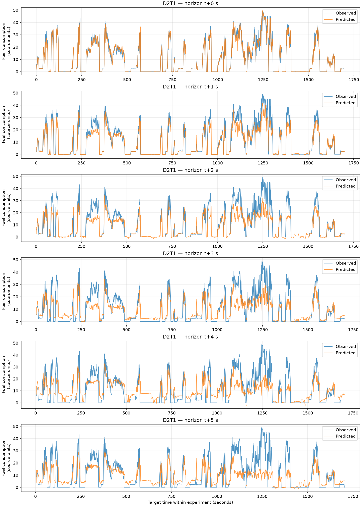
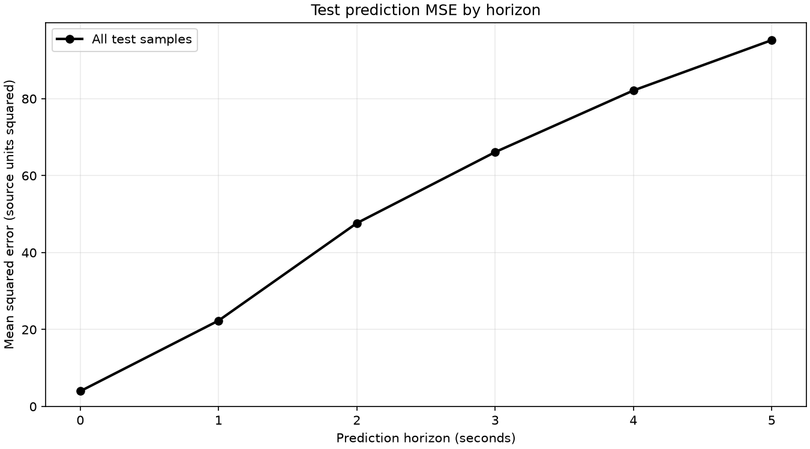
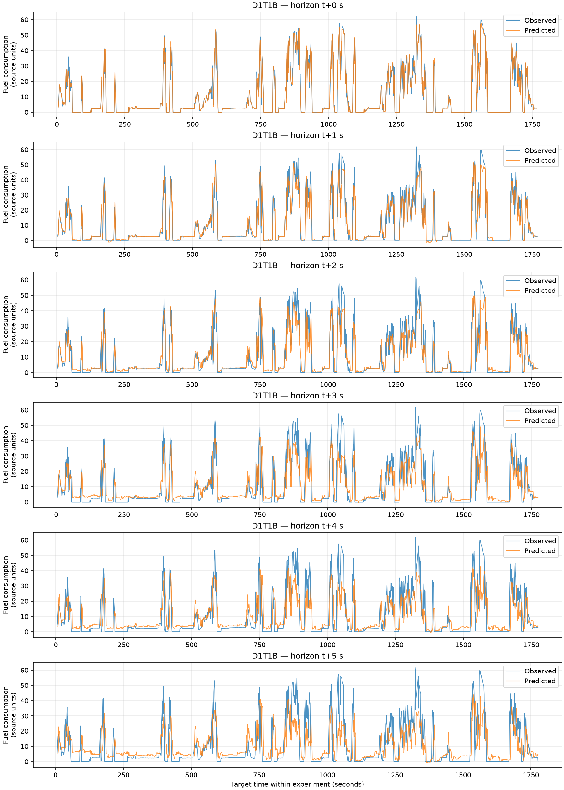
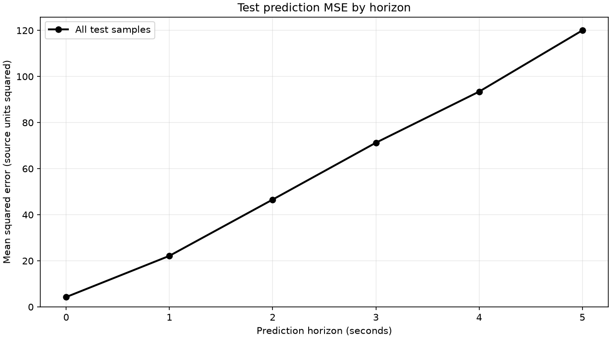
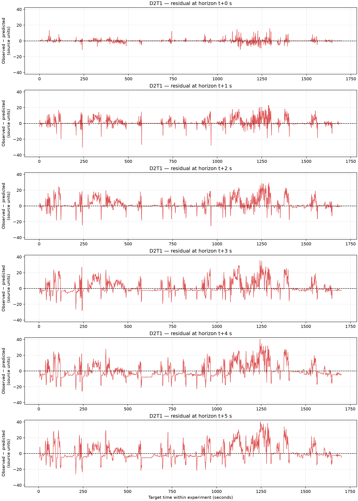
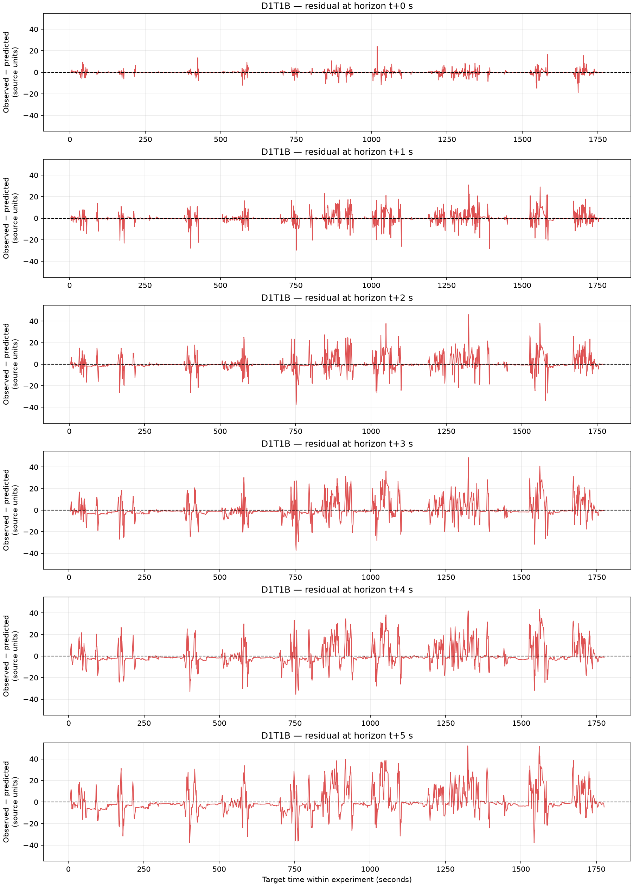
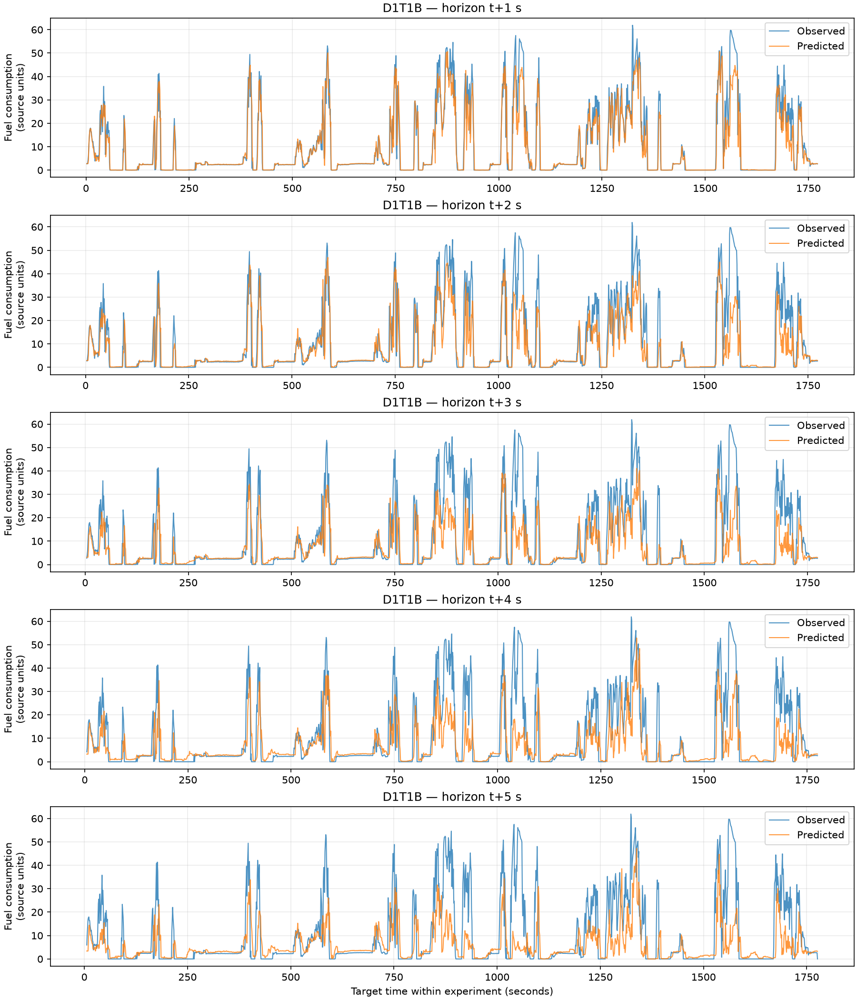
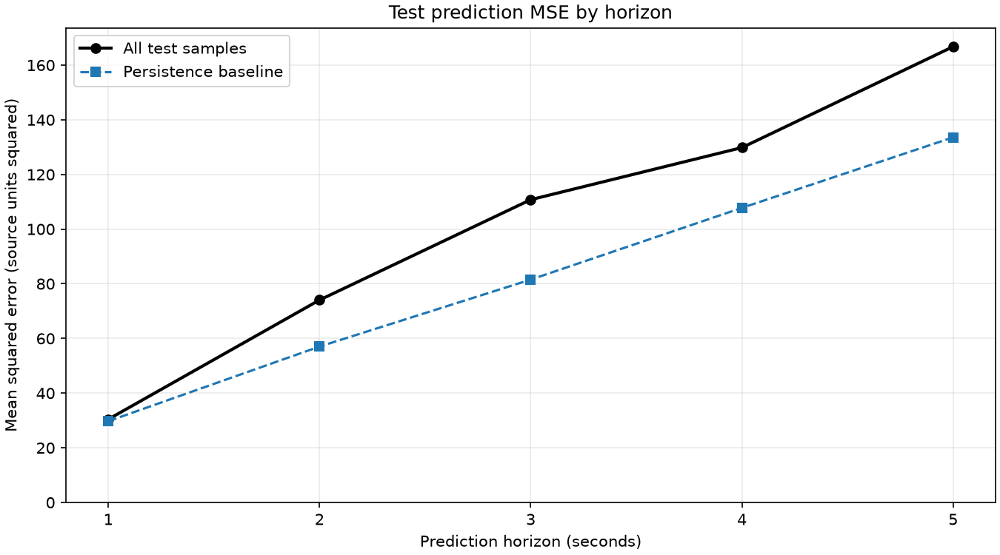
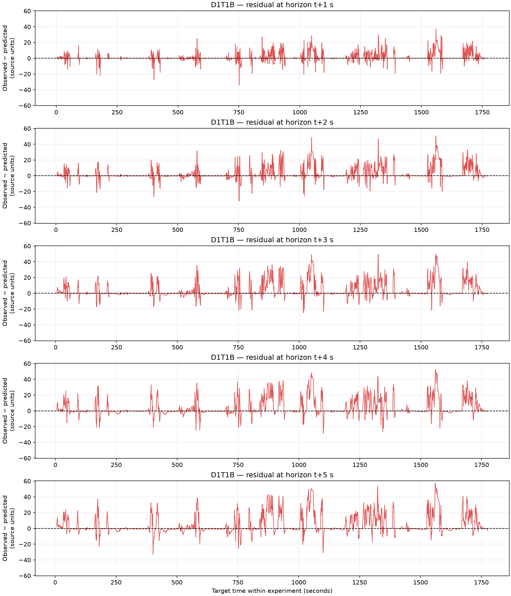

# Estimativa e previsão do consumo de combustível com dados operacionais do veículo

**Relatório de desenvolvimento e experimentos — 27 de setembro de 2026**

Este trabalho investiga a estimativa do consumo atual e a previsão de sua taxa
nos cinco segundos seguintes. Foram organizados os dados de quatro ensaios,
integradas variáveis operacionais e grupos adimensionais de Buckingham Pi e
avaliado um modelo de árvores com gradient boosting. Também foi implementado
um experimento separado de previsão de variações logarítmicas, usando consumo
atual medido e temperatura do óleo.

Os resultados são preliminares. Não houve busca de hiperparâmetros nem validação
em todos os ensaios possíveis. A inclusão da temperatura do óleo ainda não foi
avaliada em uma comparação controlada, com os mesmos dados de teste.

## 1. Dados e preparação inicial

A amostragem é de **um segundo**, conforme confirmação do responsável pelos
dados. As entradas originais são `Dados/Data_set.CSV`, que reúne as medições,
e `Dados/Data_set_param.CSV`, que associa 17 variáveis a seus nomes, unidades e
expoentes dimensionais. O arquivo Excel não é utilizado pelo carregador.

| Ensaio | Amostras originais | Amostras com respostas completas até t+5 |
|---|---:|---:|
| D1T1A | 1.984 | 1.979 |
| D1T1B | 1.776 | 1.771 |
| D1T2 | 3.876 | 3.871 |
| D2T1 | 1.703 | 1.698 |
| **Total** | **9.339** | **9.319** |

São removidas apenas as linhas em que todas as variáveis do ensaio estão
ausentes. Os últimos cinco instantes de cada ensaio não têm todas as respostas
futuras e são descartados da preparação supervisionada para esse horizonte.

O programa original constrói uma matriz dimensional de posto quatro e uma base
com 13 grupos Pi. Depois, calcula esses grupos por amostra, registra valores
indefinidos e gera transformações para modelagem e gráficos. A execução produz
seis CSVs e vinte gráficos em `Dados/`. Valores ausentes, infinitos ou zeros no
denominador tornam o Pi correspondente inválido; não é necessário descartar
todos os outros Pi da mesma amostra.

O comando que executa essa preparação é:

```bash
uv run prepare-data
```

A análise dimensional foi mantida como fonte de **atributos candidatos**. O
cancelamento das unidades não demonstra, sozinho, utilidade preditiva. A base
escolhida depende da ordem das variáveis; grupos com tempo desde o início do
registro ou velocidade no denominador exigem interpretação física e cuidado
com paradas. Ainda não foi executada uma comparação entre modelos apenas com
variáveis originais e modelos com Pi.

## 2. Organização do código e construção de X, y e metadata

Foi criado um ambiente uv com dependências registradas em `pyproject.toml` e
`uv.lock`: NumPy, pandas, SciPy, Matplotlib e scikit-learn. O código novo foi
organizado no pacote `motor`, com nomes em inglês e funções por objetivo:

| Módulo | Responsabilidade |
|---|---|
| `data_io.py` | Ler o formato original e traduzir nomes de variáveis |
| `dataset.py` | Alinhar medições e Pi e construir respostas temporais |
| `data_init.py` | Oferecer escalonamento e separação de treino/teste |
| `estimators.py` | Definir a configuração específica do modelo |
| `training.py` | Treinar, avaliar e registrar execuções |
| `reporting.py` | Salvar métricas, previsões e gráficos |
| `targets.py` e `log_change.py` | Transformar respostas e executar a previsão logarítmica |

O carregamento retorna tabelas combinadas e alinhadas:

```python
from motor import load_dataset

X, y, metadata = load_dataset(max_horizon=5)
```

`metadata` identifica o ensaio, a amostra original e o tempo de cada linha. As
respostas são construídas **dentro de cada ensaio**, antes da combinação. Assim,
o fim de um registro nunca usa o início do seguinte como resposta. O código
também verifica se o deslocamento entre linhas corresponde ao horizonte em
segundos. A concatenação não torna os registros uma série contínua; futuros
atrasos e médias móveis também deverão respeitar os limites dos ensaios.

As nove variáveis originais selecionadas são velocidade, acelerador, freio,
marcha, rotação, torque e temperaturas do líquido de arrefecimento, do óleo e
do ambiente. Os seis Pi selecionados são:

| Atributo | Expressão |
|---|---|
| `pi_1` | Acelerador |
| `pi_2` | Freio |
| `pi_3` | Marcha |
| `pi_4` | Tempo × rotação |
| `pi_7` | Temperatura do óleo / temperatura do líquido de arrefecimento |
| `pi_8` | Temperatura ambiente / temperatura do líquido de arrefecimento |

Os primeiros três repetem variáveis originais. `pi_4` incorpora a referência
temporal do registro. `pi_6`, que contém consumo, e sua transformação não entram
em X na tarefa de estimar o consumo atual, pois isso revelaria a resposta.
Injeção e massa foram excluídas da seleção inicial por faltarem em ensaios
inteiros. Distância e altitude também ficaram fora dessa primeira modelagem.

Foi implementada e verificada uma função `StandardScaler` para escalonar o X
combinado. Entretanto, **o treinamento final das árvores não usa escalonamento
de X nem de y**: as árvores utilizadas não precisam dele e aceitam NaNs. Em
modelos futuros que precisem de escalonamento, seu ajuste deve usar apenas
dados de treinamento.

## 3. Modelo e protocolo de avaliação

Foi utilizado `HistGradientBoostingRegressor`, com um regressor independente
por coluna de resposta, por meio de `MultiOutputRegressor`. Na tarefa original,
as seis respostas são taxas pontuais de consumo em t0, t+1, ..., t+5. Elas não
são volumes acumulados nem médias de intervalos.

| Parâmetro | Valor |
|---|---:|
| Número de iterações | 200 |
| Máximo de folhas por árvore | 15 |
| Taxa de aprendizado | 0,05 |
| Parada antecipada automática | Desativada |
| Semente aleatória | 42 |

A parada antecipada foi desativada para evitar uma divisão aleatória interna
de validação. Foram usados somente os atributos atuais: ainda não foram
acrescentados históricos, diferenças recentes ou janelas de sensores.

A separação `experiment` reserva para teste o menor ensaio não vazio disponível
e usa os demais para treinamento. Duas políticas foram avaliadas:

| Política | Entradas | Treinamento | Teste |
|---|---|---|---|
| Sem óleo (`ignore_oil`) | 13 atributos; exclui óleo e `pi_7` | D1T1A, D1T1B e D1T2: 7.621 amostras | D2T1: 1.698 amostras |
| Com óleo (`with_oil`) | 15 atributos; mantém óleo e `pi_7` | D1T1A e D1T2: 5.850 amostras | D1T1B: 1.771 amostras |

Não há temperatura do óleo em D2T1. Isso gera 1.698 valores ausentes nessa
variável e outros 1.698 em `pi_7`, totalizando 3.396 entradas ausentes após o
descarte das janelas incompletas. A política com óleo filtra essas linhas antes
da separação. A escolha do menor ensaio considera apenas os ensaios que
continuam presentes, evitando um conjunto de teste vazio.

**Os dois testes usam ensaios e conjuntos de treinamento diferentes.** Portanto,
uma diferença de erro não pode ser atribuída isoladamente à temperatura do
óleo. Para essa conclusão, seria necessário comparar a inclusão e a exclusão
do óleo usando as mesmas linhas e a mesma separação.

As métricas calculadas por horizonte são MAE, MSE, RMSE e R². Todas se referem à
escala original do consumo; MSE tem unidades ao quadrado. A tabela de parâmetros
indica m³/s, mas a magnitude dos valores requer confirmação na origem. Por isso,
os gráficos identificam a escala como “unidades da fonte”, sem afirmar uma
unidade física validada.

## 4. Resultados com respostas absolutas

| Horizonte | MAE sem óleo | MSE sem óleo | R² sem óleo | MAE com óleo | MSE com óleo | R² com óleo |
|---|---:|---:|---:|---:|---:|---:|
| t0 | 0,930 | 3,975 | 0,974 | 0,848 | 4,282 | 0,980 |
| t+1 | 2,557 | 22,322 | 0,856 | 2,342 | 22,161 | 0,897 |
| t+2 | 4,006 | 47,654 | 0,693 | 3,767 | 46,585 | 0,783 |
| t+3 | 5,501 | 66,115 | 0,575 | 5,107 | 71,257 | 0,668 |
| t+4 | 6,696 | 82,137 | 0,472 | 6,073 | 93,438 | 0,565 |
| t+5 | 6,774 | 95,216 | 0,388 | 7,202 | 120,011 | 0,441 |

O desempenho é melhor na estimativa contemporânea e se deteriora conforme o
horizonte aumenta. Embora o teste com óleo tenha R² maior em todos os
horizontes, isso não significa MSE menor: a variabilidade da resposta e os dados
de teste também mudam. Nesse conjunto de resultados, o MSE com óleo é menor
somente em t+1 e t+2. Assim, ainda não há evidência controlada de que a
temperatura do óleo reduza o MSE.

### 4.1 Sem temperatura do óleo — teste D2T1



**Figura 1.** Valores observados e previstos na escala original. Cada painel
representa um horizonte; o eixo horizontal corresponde ao instante da resposta.



**Figura 2.** MSE de teste em função do horizonte, sem entradas de óleo.

### 4.2 Com temperatura do óleo — teste D1T1B



**Figura 3.** Previsões com temperatura do óleo e `pi_7`, no ensaio D1T1B.



**Figura 4.** MSE por horizonte com óleo. Esta curva não usa o mesmo ensaio da
Figura 2, impedindo atribuir sua diferença apenas à inclusão do óleo.

## 5. Diagnóstico dos erros instantâneos

Foi definido o resíduo como **observado − previsto**. Valores positivos indicam
subestimação; valores negativos indicam superestimação. Os gráficos têm uma
referência em zero e usam a mesma escala vertical entre horizontes de um mesmo
ensaio. Linhas são interrompidas quando há lacunas entre amostras.



**Figura 5.** Resíduos em D2T1 sem óleo.



**Figura 6.** Resíduos em D1T1B com óleo.

Os gráficos mostram suavização dos picos e previsões positivas em parte dos
períodos com consumo zero. No horizonte t+5, a subestimação média nos casos de
consumo positivo foi de aproximadamente 5,88 sem óleo e 3,21 com óleo. Quando o
consumo real foi zero, a previsão média foi aproximadamente 4,58 e 5,13,
respectivamente. Esses números são diagnósticos condicionais, não uma afirmação
de erro do mesmo sinal em todas as amostras.

Uma explicação compatível com o comportamento observado é que o ajuste por
erro quadrático produza previsões intermediárias diante de futuros distintos
com estados atuais semelhantes. A ausência de histórico dos sensores também
limita a identificação de transições. Essas são interpretações a investigar;
não foi executado um experimento que demonstre sua causalidade. A capacidade de
acertar a direção das mudanças também ainda não foi quantificada.

## 6. Experimento de variação logarítmica com óleo

Foi criado um caminho separado, acionado por:

```bash
uv run model --target-mode log-change
```

Nesse caminho a política padrão é `with_oil`; usar `ignore_oil` é rejeitado.
Mantiveram-se o algoritmo, os hiperparâmetros e o teste D1T1B. As respostas
abrangem **apenas t+1 a t+5**. A resposta t0 foi removida, pois sua variação em
relação a ela própria seria sempre zero.

Para consumo atual c(t), consumo futuro c(t+h) e escala positiva s, define-se:

$$
\delta_h(t) = log(1 + c(t+h)/s) - log(1 + c(t)/s)
           = log((s + c(t+h)) / (s + c(t)))
$$

Foi usada a escala fixa **s = 1,0**, expressa na mesma unidade numérica do consumo
da fonte. Ela não foi otimizada. Essa é uma razão de consumos deslocados pela
escala, e não o retorno logarítmico puro `log(c(t+h)/c(t))`. O deslocamento permite
trabalhar com zeros sem divisão por consumo zero. A transformação não pressupõe
movimento browniano geométrico.

O consumo medido em t0 é acrescentado a X como `current_fuel_consumption`,
resultando em 16 entradas. Portanto, **a tarefa agora exige a disponibilidade do
sensor de consumo atual**. A tarefa original não utilizava esse sensor como
entrada. Uma diferença em relação ao resultado anterior não isola o efeito da
transformação, pois também foi acrescentada informação ao modelo.

Após prever a variação, o consumo é reconstruído:

```text
consumo_previsto = max(0, s * exp(log(1 + c(t)/s) + delta_previsto) - s)
```

O limite inferior em zero evita consumo negativo. O estimador salvo encapsula a
transformação: `predict` devolve consumo reconstruído e `predict_log_change`
devolve a variação bruta. Gráficos e métricas principais usam consumo
reconstruído, permitindo interpretação na escala original.

Como referência, utilizou-se **persistência**: prever c(t) para todos os
horizontes. Essa comparação usa o mesmo consumo atual disponível ao modelo.

| Horizonte | MAE log-change | MSE log-change | MSE persistência | R² log-change | Habilidade relativa ao MSE da persistência |
|---|---:|---:|---:|---:|---:|
| t+1 | 2,610 | 30,426 | 29,724 | 0,858 | −2,36% |
| t+2 | 4,339 | 74,057 | 57,030 | 0,655 | −29,86% |
| t+3 | 5,557 | 110,768 | 81,526 | 0,484 | −35,87% |
| t+4 | 6,244 | 129,816 | 107,771 | 0,395 | −20,45% |
| t+5 | 7,205 | 166,743 | 133,566 | 0,224 | −24,84% |

A habilidade foi calculada como `1 − MSE_modelo/MSE_persistência`. Valores
negativos indicam desempenho inferior à referência. **Nesta execução, a
transformação logarítmica não superou a persistência em nenhum horizonte.** Seu
MSE também foi maior que o do teste anterior de respostas absolutas com óleo.
Essa observação não demonstra que toda previsão de variação logarítmica seja
inadequada; descreve a configuração e a separação testadas.



**Figura 7.** Consumo reconstruído em D1T1B, de t+1 a t+5.



**Figura 8.** Comparação de MSE com a persistência nos mesmos dados de teste.



**Figura 9.** Erros instantâneos após a reconstrução do consumo.

## 7. Verificação e registros de execução

Foi verificada a execução da preparação original, do carregamento e do
treinamento. Os testes automatizados cobrem separação por ensaio, ausência de
ensaios após filtragem, conservação das entradas, arquivos de saída, sinais dos
resíduos, consistência entre MSE e RMSE e recarga de estimadores salvos.

Para o caminho logarítmico, foram testados valores de consumo zero, reconstrução
na escala original, limite inferior em zero, rejeição de escala inválida,
separação de t0 das respostas futuras, referência de persistência, recarga do
estimador e previsão com uma única saída. Também foram verificadas janelas com
lacunas temporais e os limites dos ensaios na preparação dos dados.

```bash
uv run python -m unittest discover -s tests -v
```

Cada nova execução registra uma pasta distinta:

```text
outputs/<modelo>/<split>/<politica_de_oleo>/<modo_da_resposta>/<execucao>/
```

São salvos o estimador (`model.joblib`), parâmetros e versões (`settings.json`),
métricas por horizonte (`metrics.csv`), previsões e resíduos (`predictions.csv`),
participação de cada linha no treino/teste/exclusão (`split.csv`) e gráficos.
No caminho logarítmico também são salvos `log_changes.csv` e
`persistence_metrics.csv`. As execuções antigas permanecem em suas pastas
originais, anteriores à introdução do nível de modo da resposta.

Como `outputs/` é ignorada pelo Git, os gráficos utilizados neste documento
foram copiados para `docs/figures/`, juntamente com as métricas e configurações
das três execuções. O arquivo [runs.json](figures/runs.json) identifica as fontes
e seus fingerprints. Assim, o relatório não depende da permanência dos arquivos
temporários de treinamento para mostrar seus resultados.

## 8. Limites e próximos experimentos

O estudo ainda usa uma única separação por política, sem teste independente de
seleção de hiperparâmetros. A escolha de D1T1B como teste já foi inspecionada
durante o desenvolvimento; ele não deve ser tratado como um conjunto final
intocado. As amostras consecutivas são correlacionadas e não representam milhares
de situações independentes.

Não foram treinadas redes neurais, não foi testada previsão por variação absoluta
e não houve comparação controlada com/sem Pi ou com/sem óleo. A transformação
logarítmica foi testada apenas com óleo, conforme o escopo definido.

Experimentos seguintes que podem esclarecer o problema são: incluir históricos
dos sensores respeitando os ensaios; comparar óleo e Pi sobre os mesmos dados;
avaliar cada ensaio como teste; e comparar alvos absolutos e logarítmicos com
as mesmas entradas, inclusive consumo atual. Uma avaliação de períodos com
consumo zero separada dos períodos positivos pode mostrar se o ganho se
concentra nas transições ou nas magnitudes.

## Referências de implementação

- [HistGradientBoostingRegressor — documentação do scikit-learn](https://scikit-learn.org/stable/modules/generated/sklearn.ensemble.HistGradientBoostingRegressor.html).
- [MultiOutputRegressor — documentação do scikit-learn](https://scikit-learn.org/stable/modules/generated/sklearn.multioutput.MultiOutputRegressor.html).
- [Cuidados com vazamento e pré-processamento — scikit-learn](https://scikit-learn.org/stable/common_pitfalls.html).
